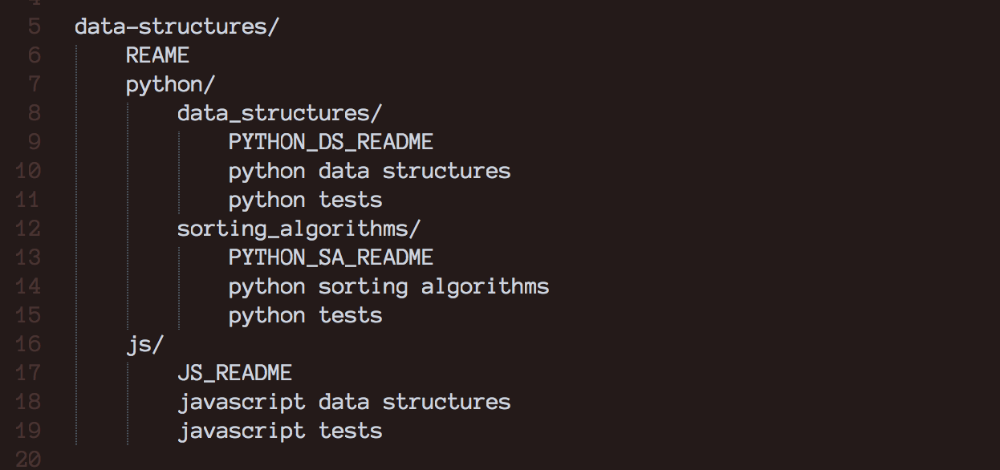

[](https://travis-ci.org/adriennekarnoski/data-structures)
[](https://coveralls.io/github/adriennekarnoski/data-structures?branch=master)

# Data Structures & Algorithms

This repository has two directories inside, **python** and **js**.

## Getting Started

Within the Python directory, the **data_structures** sub-directory has test files
for each structure, whereas the **sorting_algorithms** sub-directory has a single
test file that covers all algorithms.

The Javascript directory has data structures, tests, and a README describing the Big-O Notation.

You can install this package, where you will be able to run, test, and improve the code
or view everything right here on GitHub.


**File Structure**



## Installation

### Python

```
#Clone the repository

$ git clone https://github.com/adriennekarnoski/data-structures

#Move into the **python** directory

$ cd python
```

Clone the repository:

`$ git clone https://github.com/adriennekarnoski/data-structures`

Move into the **python** directory:

`$ cd python`

Start your virtual environment:

`$ python3 -m venv ENV`

`$ source bin/ENV/activate`

Install package

`$ (ENV) pip install -e .`

**testing**

`$ (ENV) pip install -e .[test]`

`$ (ENV) tox`

***

### Javascript

Clone the repository:

`$ git clone https://github.com/adriennekarnoski/data-structures`

Move into the **js** directory:

`$ cd js`

Install package

`npm install data-structures`

**testing**

`$ npm test`

## Check out the Code
View all the code or read the documentation

### Python

**Data Structures:**
[ [CODE] ](https://github.com/adriennekarnoski/data-structures/tree/master/data_structures)
[ [DOCS] ](https://github.com/adriennekarnoski/data-structures/blob/master/data_structures/README.md)


**Sorting Algorithms:**
[ [CODE] ](https://github.com/adriennekarnoski/data-structures/tree/master/sorting_algorithms)
[ [DOCS] ](https://github.com/adriennekarnoski/data-structures/blob/master/sorting_algorithms/README.md)


### Javascript
**Data Structures:**
[ [CODE] ](https://github.com/adriennekarnoski/data-structures/tree/master/data_structures)
[ [DOCS] ](https://github.com/adriennekarnoski/data-structures/blob/master/data_structures/README.md)